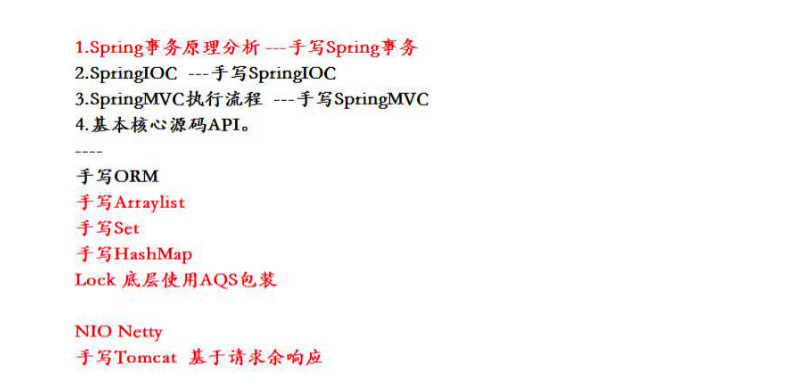
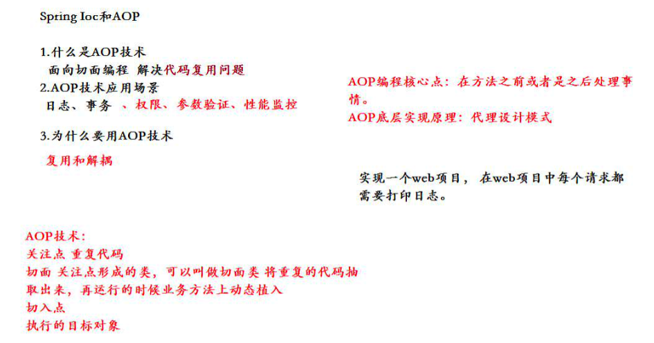

# 手写Spring事务框架





## Spring事务原理


## IOC和AOP


## 编程事务实现

### 概述

所谓编程式事务指的是通过编码方式实现事务，即类似于JDBC编程实现事务管理。管理使用TransactionTemplate或者直接使用底层的PlatformTransactionManager。对于编程式事务管理，spring推荐使用TransactionTemplate。

### 案例

#### 使用编程事务实现手动事务
使用编程事务实现，手动事务 begin、commit、rollback

```
@Component
public class TransactionUtils {

	@Autowired
	private DataSourceTransactionManager dataSourceTransactionManager;

	// 开启事务
	public TransactionStatus begin() {
		TransactionStatus transaction = dataSourceTransactionManager.getTransaction(new DefaultTransactionAttribute());
		return transaction;
	}

	// 提交事务
	public void commit(TransactionStatus transactionStatus) {
		dataSourceTransactionManager.commit(transactionStatus);
	}

	// 回滚事务
	public void rollback(TransactionStatus transactionStatus) {
		dataSourceTransactionManager.rollback(transactionStatus);
	}
}
```

```
@Service
public class UserService {
	@Autowired
	private UserDao userDao;
	@Autowired
	private TransactionUtils transactionUtils;

	public void add() {
		TransactionStatus transactionStatus = null;
		try {
			transactionStatus = transactionUtils.begin();
			userDao.add("wangmazi", 27);
			int i = 1 / 0;
			System.out.println("我是add方法");
			userDao.add("zhangsan", 16);
			transactionUtils.commit(transactionStatus);
		} catch (Exception e) {
			e.printStackTrace();
		} finally {
			if (transactionStatus != null) {
				transactionStatus.rollbackToSavepoint(transactionStatus);
			}
		}

	}

}
```
#### AOP技术封装手动事务

```
@Component
@Aspect
public class AopTransaction {
	@Autowired
	private TransactionUtils transactionUtils;

	// // 异常通知
	@AfterThrowing("execution(* com.itmayiedu.service.UserService.add(..))")
	public void afterThrowing() {
		System.out.println("程序已经回滚");
		// 获取程序当前事务 进行回滚
		TransactionAspectSupport.currentTransactionStatus().setRollbackOnly();
	}

	// 环绕通知
	@Around("execution(* com.itmayiedu.service.UserService.add(..))")
	public void around(ProceedingJoinPoint proceedingJoinPoint) throws Throwable {
		System.out.println("开启事务");
		TransactionStatus begin = transactionUtils.begin();
		proceedingJoinPoint.proceed();
		transactionUtils.commit(begin);
		System.out.println("提交事务");
	}

}
```

#### 使用事务注意事项

事务是程序运行如果没有错误,会自动提交事物,如果程序运行发生异常,则会自动回滚。 
如果使用了try捕获异常时.一定要在catch里面手动回滚。
事务手动回滚代码
TransactionAspectSupport.currentTransactionStatus().setRollbackOnly();

## 声明事务实现

### 概述
管理建立在AOP之上的。其本质是对方法前后进行拦截，然后在目标方法开始之前创建或者加入一个事务，在执行完目标方法之后根据执行情况提交或者回滚事务。声明式事务最大的优点就是不需要通过编程的方式管理事务，这样就不需要在业务逻辑代码中掺杂事务管理的代码，只需在配置文件中做相关的事务规则声明(或通过基于@Transactional注解的方式)，便可以将事务规则应用到业务逻辑中。
       显然声明式事务管理要优于编程式事务管理，这正是spring倡导的非侵入式的开发方式。

声明式事务管理使业务代码不受污染，一个普通的POJO对象，只要加上注解就可以获得完全的事务支持。和编程式事务相比，声明式事务唯一不足地方是，后者的最细粒度只能作用到方法级别，无法做到像编程式事务那样可以作用到代码块级别。但是即便有这样的需求，也存在很多变通的方法，比如，可以将需要进行事务管理的代码块独立为方法等等。

### XML实现声明

### 注解版本声明

```
<beans xmlns="http://www.springframework.org/schema/beans"
	xmlns:xsi="http://www.w3.org/2001/XMLSchema-instance" xmlns:p="http://www.springframework.org/schema/p"
	xmlns:context="http://www.springframework.org/schema/context"
	xmlns:aop="http://www.springframework.org/schema/aop" xmlns:tx="http://www.springframework.org/schema/tx"
	xsi:schemaLocation="http://www.springframework.org/schema/beans
    	 http://www.springframework.org/schema/beans/spring-beans.xsd
     	 http://www.springframework.org/schema/context
         http://www.springframework.org/schema/context/spring-context.xsd
         http://www.springframework.org/schema/aop
         http://www.springframework.org/schema/aop/spring-aop.xsd
         http://www.springframework.org/schema/tx
     	 http://www.springframework.org/schema/tx/spring-tx.xsd">


	<!-- 开启注解 -->
	<context:component-scan base-package="com.itmayiedu"></context:component-scan>
	<!-- 1. 数据源对象: C3P0连接池 -->
	<bean id="dataSource" class="com.mchange.v2.c3p0.ComboPooledDataSource">
		<property name="driverClass" value="com.mysql.jdbc.Driver"></property>
		<property name="jdbcUrl" value="jdbc:mysql://localhost:3306/test"></property>
		<property name="user" value="root"></property>
		<property name="password" value="root"></property>
	</bean>

	<!-- 2. JdbcTemplate工具类实例 -->
	<bean id="jdbcTemplate" class="org.springframework.jdbc.core.JdbcTemplate">
		<property name="dataSource" ref="dataSource"></property>
	</bean>

	<!-- 配置事物 -->
	<bean id="dataSourceTransactionManager"
		class="org.springframework.jdbc.datasource.DataSourceTransactionManager">
		<property name="dataSource" ref="dataSource"></property>
	</bean>
	<!-- 开启注解事物 -->
	<tx:annotation-driven transaction-manager="dataSourceTransactionManager" />
</beans>
```

> 用法

```
@Transactional
	public void add() {
		userDao.add("wangmazi", 27);
		int i = 1 / 0;
		System.out.println("我是add方法");
		userDao.add("zhangsan", 16);
	}
```

# Spring事物传播行为

Spring中事务的定义：

- Propagation（key属性确定代理应该给哪个方法增加事务行为。这样的属性最重要的部份是传播行为。）有以下选项可供使用：
- PROPAGATION_REQUIRED--支持当前事务，如果当前没有事务，就新建一个事务。这是最常见的选择。
- PROPAGATION_SUPPORTS--支持当前事务，如果当前没有事务，就以非事务方式执行。
- PROPAGATION_MANDATORY--支持当前事务，如果当前没有事务，就抛出异常。 
- PROPAGATION_REQUIRES_NEW--新建事务，如果当前存在事务，把当前事务挂起。 
- PROPAGATION_NOT_SUPPORTED--以非事务方式执行操作，如果当前存在事务，就把当前事务挂起。 
- PROPAGATION_NEVER--以非事务方式执行，如果当前存在事务，则抛出异常。


