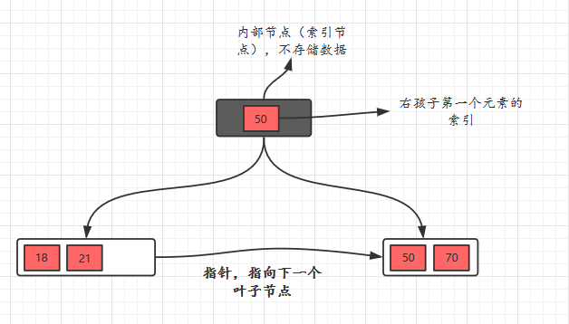

# B树

B树也称B-树,它是一颗多路平衡查找树。二叉树我想大家都不陌生，其实，B树和后面讲到的B+树也是从最简单的二叉树变换而来的，并没有什么神秘的地方，下面我们来看看B树的定义。

* 每个节点最多有m-1个关键字（可以存有的键值对）。
* 根节点最少可以只有1个关键字。
* 非根节点至少有m/2个关键字。
* 每个节点中的关键字都按照从小到大的顺序排列，每个关键字的左子树中的所有关键字都小于它，而右子树中的所有关键字都大于它。
* 所有叶子节点都位于同一层，或者说根节点到每个叶子节点的长度都相同。
* 每个节点都存有索引和数据，也就是对应的key和value。

所以，根节点的关键字数量范围：1 <= k <= m-1，非根节点的关键字数量范围：m/2 <= k <= m-1。

另外，我们需要注意一个概念，描述一颗B树时需要指定它的阶数，阶数表示了一个节点最多有多少个孩子节点，一般用字母m表示阶数。

我们再举个例子来说明一下上面的概念，比如这里有一个5阶的B树，根节点数量范围：1 <= k <= 4，非根节点数量范围：2 <= k <= 4。

下面，我们通过一个插入的例子，讲解一下B树的插入过程，接着，再讲解一下删除关键字的过程。

## B树插入
插入的时候，我们需要记住一个规则：判断当前结点key的个数是否小于等于m-1，如果满足，直接插入即可，如果不满足，将节点的中间的key将这个节点分为左右两部分，中间的节点放到父节点中即可。

## B树的删除操作
B树的删除操作相对于插入操作是相对复杂一些的，但是，你知道记住几种情况，一样可以很轻松的掌握的。

详细过程见参看文献[面试官问你B树和B+树，就把这篇文章丢给他](https://juejin.im/post/5d8194b5e51d4561e6237214)

# B+树概述
B+树其实和B树是非常相似的，

> 我们首先看看相同点。

* 根节点至少一个元素
* 非根节点元素范围：m/2 <= k <= m-1

> 不同点

* B+树有两种类型的节点：**`内部结点（也称索引结点）和叶子结点。内部节点就是非叶子节点，内部节点不存储数据，只存储索引，数据都存储在叶子节点。`**
* 内部结点中的key都按照从小到大的顺序排列，对于内部结点中的一个key，左树中的所有key都小于它，右子树中的key都大于等于它。叶子结点中的记录也按照key的大小排列。
* 每个叶子结点都存有相邻叶子结点的指针，叶子结点本身依关键字的大小自小而大顺序链接。
* 父节点存有右孩子的第一个元素的索引。

下面我们看一个B+树的例子，感受感受它吧！

# B树和B+树总结
B+树相对于B树有一些自己的优势，可以归结为下面几点。

* 单一节点存储的元素更多，使得查询的IO次数更少，所以也就使得它更适合做为数据库MySQL的底层数据结构了。
* 所有的查询都要查找到叶子节点，查询性能是稳定的，而B树，每个节点都可以查找到数据，所以不稳定。
* 所有的叶子节点形成了一个有序链表，更加便于查找

# 参考文献

- [面试官问你B树和B+树，就把这篇文章丢给他](https://juejin.im/post/5d8194b5e51d4561e6237214)