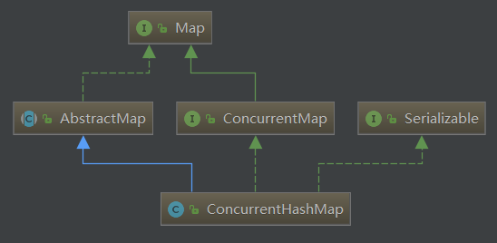
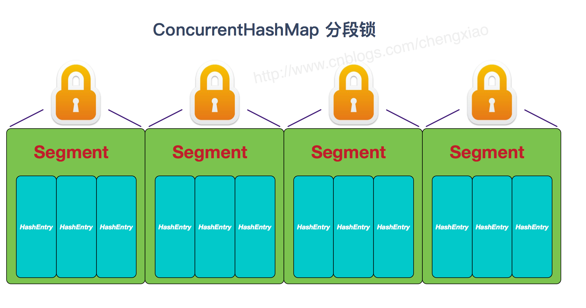

# ConcurrentHashMap源码解析

HashMap的相关源码实现，并且我们知道它是线程不安全的，在并发环境中使用时，HashMap在扩容的时候有可能会生成一个环形链表，从而导致get形成死循环超时。那这篇我们就来介绍一下并发环境下使用的HashMap——ConcurrentHashMap，下面是它的类关系图。




# JDK1.7中的实现


JDK1.7 中的ConcurrentHashMap采用了`分段锁`的设计，先来看一下它的数据结构。ConcurrentHashMap中含有一个`Segment数组`。每个Segment中又含有一个HashEntry数组。

Segment是一种可重入锁，在ConcurrentHashMap里扮演锁的角色；HashEntry则用于存储键值对数据。

一个ConcurrentHashMap里包含一个Segment数组。Segment的结构和HashMap类似，是一种数组和链表结构。一个Segment里包含一个HashEntry数组，每一个HashEntry是一个链表结构的元素，每个Segment守护着一个HashEntry数组里的元素，当对HashEntry数组的数据进行修改时，必须首先获得与它对应的Segment锁。

ConcurrentHashMap通过使用分段锁技术，将数据分成一段一段的存储，然后给每一段数据配一把锁，当一个线程占用锁访问其中一个段数据的时候，其他段的数据也能被其他线程访问，能够实现真正的并发访问。



来看看上述Segment结构的定义：

```
static final class Segment extends ReentrantLock implements Serializable {
    private static final long serialVersionUID = 2249069246763182397L;
    static final int MAX_SCAN_RETRIES =
        Runtime.getRuntime().availableProcessors() > 1 ? 64 : 1;
    transient volatile HashEntry[] table;
    transient int count;
    transient int modCount;
    transient int threshold;
    final float loadFactor;
    ... ...
}
```

## 1. 存储结构

```
static final class HashEntry<K,V> {
    final int hash;
    final K key;
    volatile V value;
    volatile HashEntry<K,V> next;
}

```

ConcurrentHashMap 和 HashMap 实现上类似，最主要的差别是 ConcurrentHashMap 采用了分段锁（Segment），每个分段锁维护着几个桶（HashEntry），多个线程可以同时访问不同分段锁上的桶，从而使其并发度更高（并发度就是 Segment 的个数）。Segment 继承自 ReentrantLock。


```
static final class Segment<K,V> extends ReentrantLock implements Serializable {
    private static final long serialVersionUID = 2249069246763182397L;

    static final int MAX_SCAN_RETRIES =
        Runtime.getRuntime().availableProcessors() > 1 ? 64 : 1;

    transient volatile HashEntry<K,V>[] table;

    transient int count;

    transient int modCount;

    transient int threshold;

    final float loadFactor;
}
final Segment<K,V>[] segments;
```

不看下面的方法，可以看到几个熟悉的字段。HashEntry(哈希数组)，threshold(扩容阈值)，loadFactor(负载因子)表示segment是一个完整的HashMap。
接下来我们看看ConcurrentHashMap的构造函数

```
public ConcurrentHashMap(int initialCapacity,float loadFactor, int concurrencyLevel)
```

三个参数分别代表了：

- 初始容量：初始容量表示所有的segment数组中，一共含有多少个hashentry。若initialCapacity不为2的幂，会取一个大于initialCapacity的2的幂。
- 负载因子：默认0.75。
- 并发级别：可以同时允许多少个线程并发。concurrencyLevel为多少，就有多少个segment，当然也会取一个大于等于这个值的2的幂。默认的并发级别为 16，也就是说默认创建 16 个 Segment。

接下来我们看一下ConcurrentHashMap中的几个关键函数，get，put，rehash(扩容), size方法，看看他是如何实现并发的。

## 2. get 操作
todo 


# 参考文献
- [源码分析——ConcurrentHashMap](https://juejin.im/post/5d06f6cb6fb9a07ec42b5ae0)


