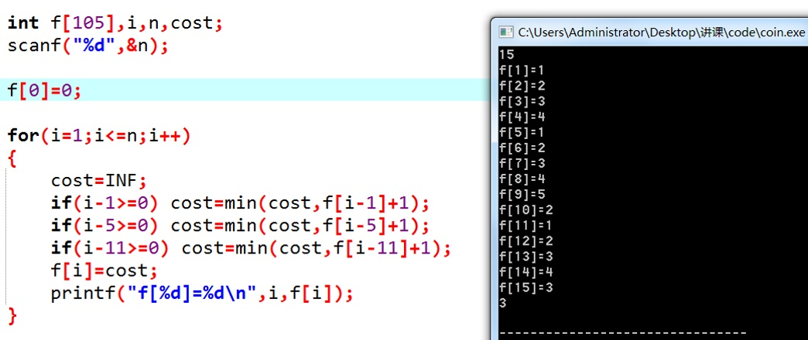

# 动态规划引入

## 从一个生活问题谈起　　
先来看看生活中经常遇到的事吧——假设您是个土豪，身上带了足够的1、5、10、20、50、100元面值的钞票。现在您的目标是凑出某个金额w，需要用到尽量少的钞票。　　

依据生活经验，我们显然可以采取这样的策略：能用100的就尽量用100的，否则尽量用50的……依次类推。在这种策略下，666=6×100+1×50+1×10+1×5+1×1，共使用了10张钞票。　　

这种策略称为“**贪心**”：假设我们面对的局面是“需要凑出w”，贪心策略会尽快让w变得更小。能让w少100就尽量让它少100，这样我们接下来面对的局面就是凑出w-100。长期的生活经验表明，贪心策略是正确的。

　　但是，如果我们换一组钞票的面值，贪心策略就也许不成立了。如果一个奇葩国家的钞票面额分别是1、5、11，那么我们在凑出15的时候，贪心策略会出错：

15=1×11+4×1    （贪心策略使用了5张钞票）
15=3×5               （正确的策略，只用3张钞票）　　
为什么会这样呢？贪心策略错在了哪里？

鼠目寸光。　　
刚刚已经说过，贪心策略的纲领是：“尽量使接下来面对的w更小”。这样，贪心策略在w=15的局面时，会优先使用11来把w降到4；但是在这个问题中，凑出4的代价是很高的，必须使用4×1。如果使用了5，w会降为10，虽然没有4那么小，但是凑出10只需要两张5元。　　
在这里我们发现，贪心是一种只考虑眼前情况的策略。那么，现在我们怎样才能避免鼠目寸光呢？

重新分析刚刚的例子。w=15时，我们如果取11，接下来就面对w=4的情况；如果取5，则接下来面对w=10的情况。我们发现这些问题都有相同的形式：“给定w，凑出w所用的最少钞票是多少张？”接下来，我们用f(n)来表示“凑出n所需的最少钞票数量”。　　

那么，如果我们取了11，最后的代价（用掉的钞票总数）是多少呢？　　

明显 ，它的意义是：利用11来凑出15，付出的代价等于f(4)加上自己这一张钞票。现在我们暂时不管f(4)怎么求出来。　　
依次类推，马上可以知道：如果我们用5来凑出15，cost就是 。　　
那么，现在w=15的时候，我们该取那种钞票呢？当然是各种方案中，cost值最低的那一个！　　

- 取11：cost = f(4)+1 = 4+1 =5
- 取5： cost = f(10)+1 = 2+1 = 3
- 取1： cost = f(14)+1=4+1=5

显而易见，cost值最低的是取5的方案。我们通过上面三个式子，做出了正确的决策！

这给了我们一个至关重要的启示—— f(n)只与f(n-1), f(n-5), f(n-11)有关，更准确地书说：
f(n)=min{f(n-1),f(n-5),f(n-11)} + 1

这个式子是非常激动人心的。我们要求出f(n)，只需要求出几个更小的f值；既然如此，我们从小到大把所有的f(i)求出来不就好了？注意一下边界情况即可。代码如下：

我们以O(n)的复杂度解决了这个问题。现在回过头来，我们看看它的原理：

# 动态规划算法

适合采用动态规划方法的最优化问题的俩个要素：最优子结构性质，和子问题重叠性质。

- 最优子结构：如果问题的最优解所包含的子问题的解也是最优的，我们就称该问题具有最优子结构性质（即满足最优化原理）。意思就是，总问题包含很多个子问题，而这些子问题的解也是最优的。

- 重叠子问题：子问题重叠性质是指在用递归算法自顶向下对问题进行求解时，每次产生的子问题并不总是新问题，有些子问题会被重复计算多次。动态规划算法正是利用了 这种子问题的重叠性质，对每一个子问题只计算一次，然后将其计算结果保存在一个表格中，当再次需要计算已经计算过的子问题时，只是在表格中简单地查看一下 结果，从而获得较高的效率。

总结而言，一个问题是该用递推、贪心、搜索还是动态规划，完全是由这个问题本身阶段间状态的转移方式决定的：

- 每个阶段只有一个状态->递推；

- 每个阶段的最优状态都是由上一个阶段的最优状态得到的->贪心；

- 每个阶段的最优状态是由之前所有阶段的状态的组合得到的->搜索；

- 每个阶段的最优状态可以从之前某个阶段的某个或某些状态直接得到而不管之前这个状态是如何得到的->动态规划。

# 应用场景

常见的应用场景有以下几个：
- 斐波那契数列问题
- 0-1背包问题（ ✔️）
- 矩阵连乘法（ ✔️）
- 硬币找零
- 字符串相似度
- 最长公共子序列
- 最长递增子序列
- 最大连续子序列和/积
- 有代价的最短路径DGA
- 瓷砖覆盖（状态压缩DP）
- 工作量划分

# 参考文献
* [浅谈什么是动态规划以及相关的「股票」算法题](https://juejin.im/post/5cd91b7351882568666df958)
* [漫画：什么是动态规划？【很好】](https://juejin.im/post/5a29d52cf265da43333e4da7)
* [动态规划](https://segmentfault.com/a/1190000004454832)
* [前端跳槽面试算法——动态规划](https://juejin.im/post/5cde316f6fb9a07ed9118f01)
* [【干货】动态规划十问十答](https://juejin.im/post/58f2ae6ab123db192ecd3042)
* [什么是动态规划（Dynamic Programming）？动态规划的意义是什么？(原理讲得好)](https://www.zhihu.com/question/23995189/answer/723475721)
* [动态规划套路详解【好】](https://zhuanlan.zhihu.com/p/78220312)