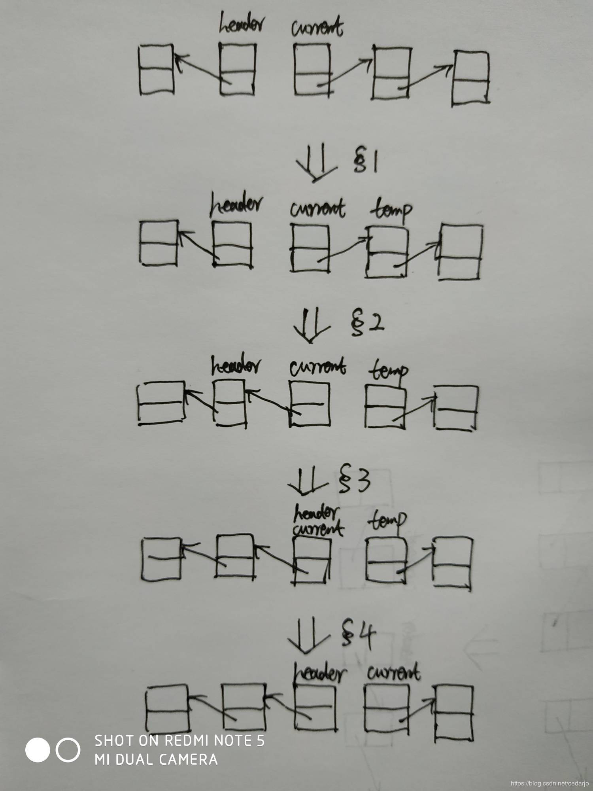

# 单链表反转


先说下思路：所谓的单链表反转，就是把每个节点的指针域由原来的指向下一个节点变为指向其前一个节点。但由于单链表没有指向前一个节点的指针域，因此我们需要增加一个指向前一个节点的指针pre，用于存储每一个节点的前一个节点。此外，还需要定义一个保存当前节点的指针cur，以及下一个节点的next。定义好这三个指针后，遍历单链表，将当前节点的指针域指向前一个节点，之后将定义三个指针往后移动，直至遍历到最后一个节点停止。



OK，说完思路，直接上代码。

```
public static Node reverseListNode(Node head){
        //单链表为空或只有一个节点，直接返回原单链表
        if (head == null || head.getNext() == null){
            return head;
        }
        //前一个节点指针
        Node preNode = null;
        //当前节点指针
        Node curNode = head;
        //下一个节点指针
        Node nextNode = null;
 
        while (curNode != null){
            nextNode = curNode.getNext();//nextNode 指向下一个节点
            curNode.setNext(preNode);//将当前节点next域指向前一个节点
            preNode = curNode;//preNode 指针向后移动
            curNode = nextNode;//curNode指针向后移动
        }
 
        return preNode;
    }
```

# 参考文献

- [单链表反转（JAVA）(好)](https://blog.csdn.net/cedarjo/article/details/88421448)
- [Java实现单链表反转操作](https://blog.csdn.net/lwkrsa/article/details/82015364)