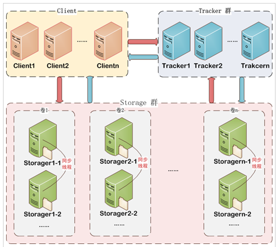
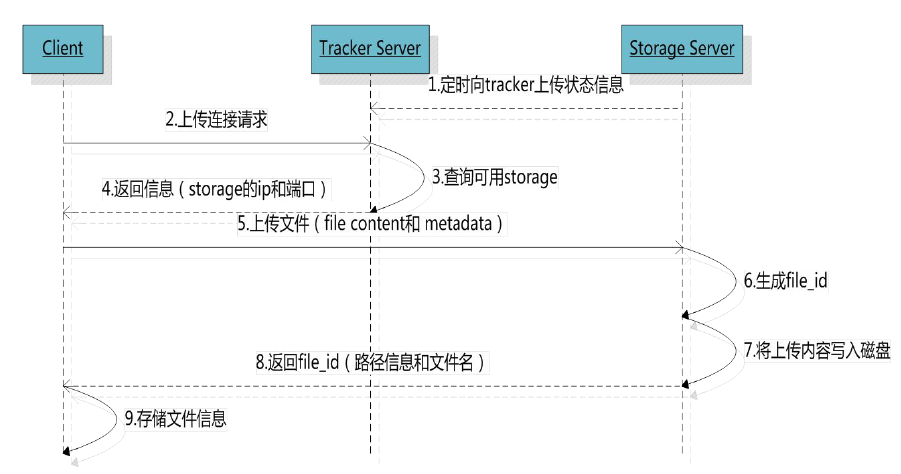
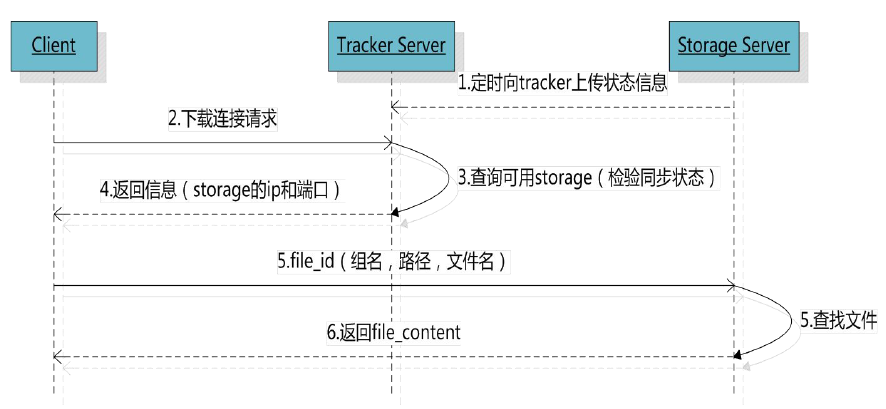

# 4.1什么是FastDFS
FastDFS是用c语言编写的一款开源的分布式文件系统。FastDFS为互联网量身定制，充分考虑了冗余备份、负载均衡、线性扩容等机制，并注重高可用、高性能等指标，使用FastDFS很容易搭建一套高性能的文件服务器集群提供文件上传、下载等服务。




# 4.2文件上传流程




# 文件下载流程





# 4.4上传文件的文件名

客户端上传文件后存储服务器将文件ID返回给客户端，此文件ID用于以后访问该文件的索引信息。文件索引信息包括：组名，虚拟磁盘路径，数据两级目录，文件名。


- 组名：文件上传后所在的storage组名称，在文件上传成功后有storage服务器返回，需要客户端自行保存。 
- 虚拟磁盘路径：storage配置的虚拟路径，与磁盘选项store_path*对应。如果配置了store_path0则是M00，如果配置了store_path1则是M01，以此类推。
- 数据两级目录：storage服务器在每个虚拟磁盘路径下创建的两级目录，用于存储数据文件。


文件名：与文件上传时不同。是由存储服务器根据特定信息生成，文件名包含：源存储服务器IP地址、文件创建时间戳、文件大小、随机数和文件拓展名等信息。

# 图片服务的使用

官方提供一个jar包
使用方法：

1. 把FastDFS提供的jar包添加到工程中
2. 初始化全局配置。加载一个配置文件。
3. 创建一个TrackerClient对象。
4. 创建一个TrackerServer对象。
5. 声明一个StorageServer对象，null。
6. 获得StorageClient对象。
7. 直接调用StorageClient对象方法上传文件即可。

```
@Test
	public void testUpload() throws Exception {
		// 1、把FastDFS提供的jar包添加到工程中
		// 2、初始化全局配置。加载一个配置文件。
		ClientGlobal.init("D:\\workspaces-itcast\\JaveEE18\\taotao-manager\\taotao-manager-web\\src\\main\\resources\\properties\\client.conf");
		// 3、创建一个TrackerClient对象。
		TrackerClient trackerClient = new TrackerClient();
		// 4、创建一个TrackerServer对象。
		TrackerServer trackerServer = trackerClient.getConnection();
		// 5、声明一个StorageServer对象，null。
		StorageServer storageServer = null;
		// 6、获得StorageClient对象。
		StorageClient storageClient = new StorageClient(trackerServer, storageServer);
		// 7、直接调用StorageClient对象方法上传文件即可。
		String[] strings = storageClient.upload_file("D:\\Documents\\Pictures\\images\\2f2eb938943d.jpg", "jpg", null);
		for (String string : strings) {
			System.out.println(string);
		}
	}
```

Client.conf

```
tracker_server=192.168.25.133:22122
```

## 4.7使用工具类上传图片

```
@Test
	public void testFastDfsClient() throws Exception {
		FastDFSClient client = new FastDFSClient("D:\\workspaces-itcast\\JaveEE18\\taotao-manager\\taotao-manager-web\\src\\main\\resources\\properties\\client.conf");
		String uploadFile = client.uploadFile("D:\\Documents\\Pictures\\images\\200811281555127886.jpg", "jpg");
		System.out.println(uploadFile);
	}
```

