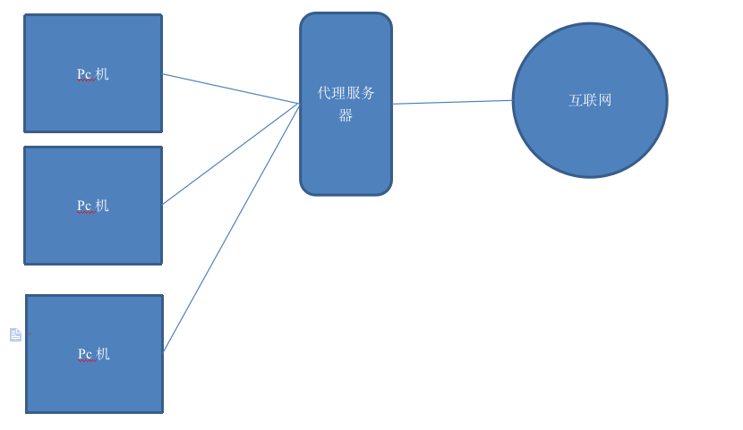
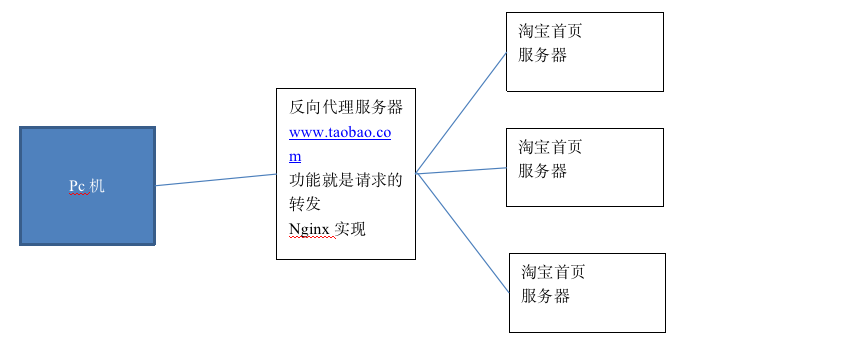
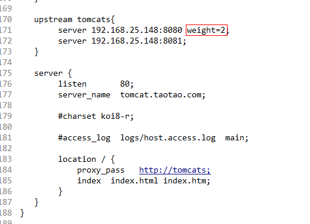

# 2课程计划
1. nginx反向代理和负载均衡
2. FastDFS的使用(国产的，曾在阿里的一个工程师)

实现图片上传功能


# 3Nginx的反向代理

## 3.1什么是反向代理
正向代理




反向代理



反向代理服务器是引用在服务端。决定哪台服务器提供服务。

## 3.2反向代理的模拟

3.2.1反向代理

应该有一个nginx服务器有多个应用服务器（可以是tomcat）

可以使用一台虚拟机，安装一个nginx，多个tomcat，来模拟。

Nginx的配置文件：

```
 upstream tomcats{
	server 192.168.25.148:8080;
	server 192.168.25.148:8081;
   }

   server {
        listen       80;
        server_name  tomcat.taotao.com;

        #charset koi8-r;

        #access_log  logs/host.access.log  main;

        location / {
            proxy_pass   http://tomcats;
            index  index.html index.htm;
        }
   }
```

## 3.2.2负载均衡
只需要在upstream的server后面添加一个weight即可代表权重。权重越高，分配请求的数量就越多。默认权重是1




