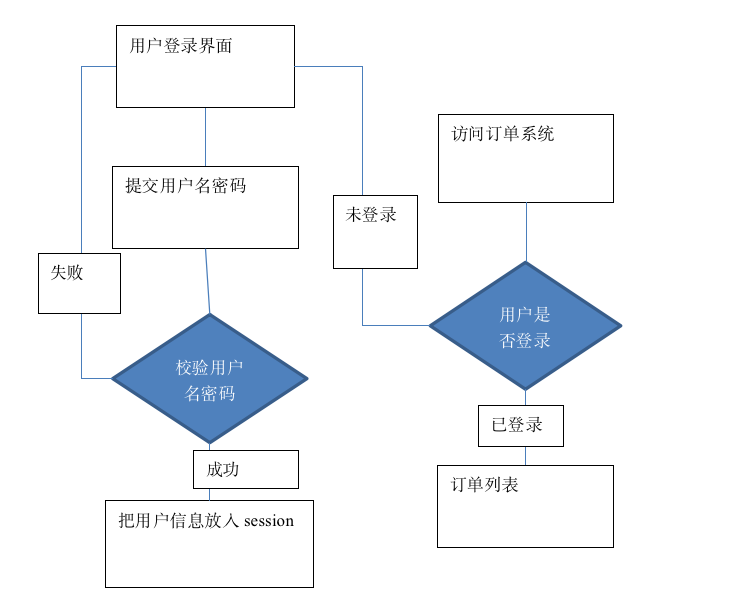
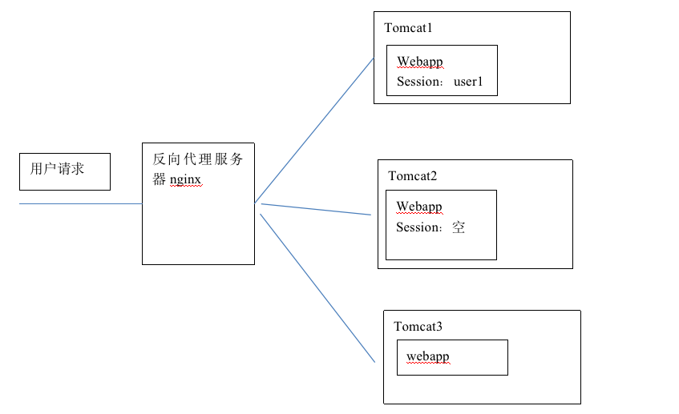
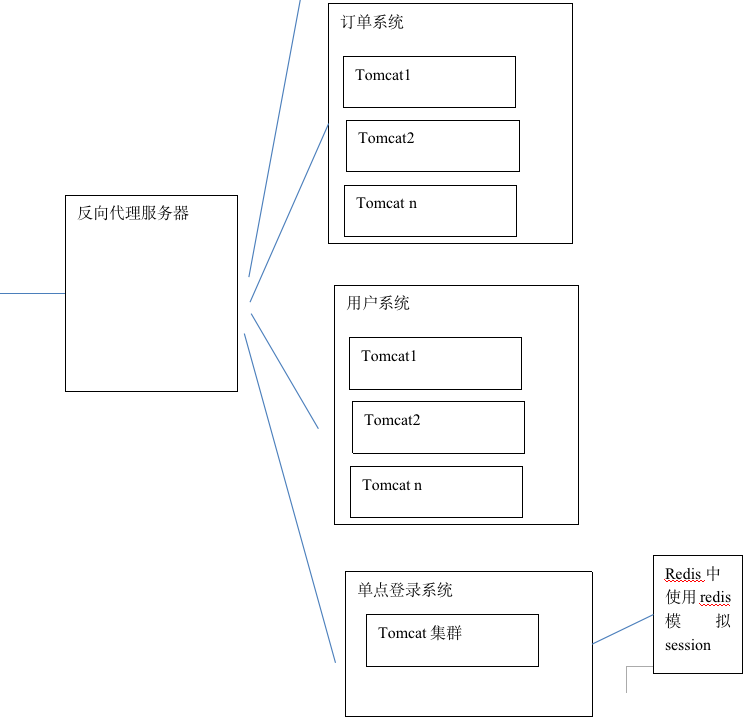
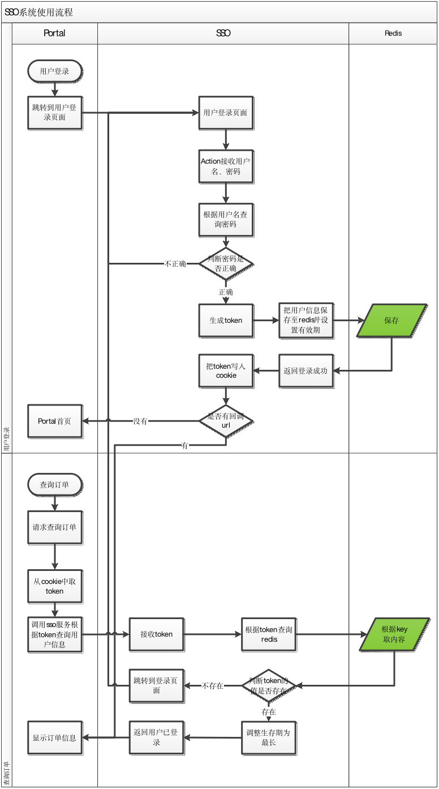
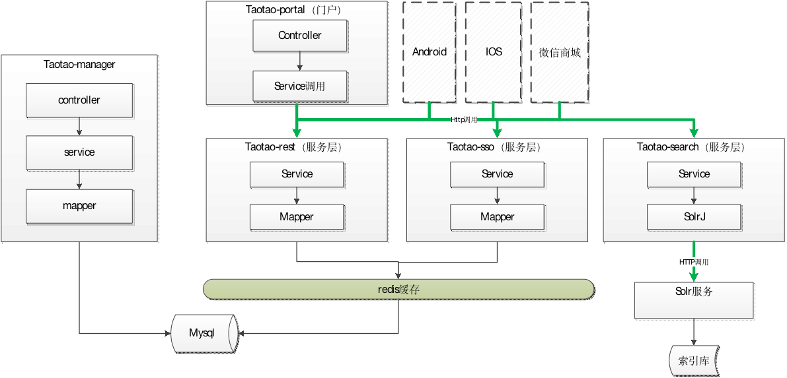

# 3单点登录系统

## 3.1什么是单点登录系统
SSO英文全称Single Sign On，单点登录。SSO是在多个应用系统中，用户只需要登录一次就可以访问所有相互信任的应用系统。它包括可以将这次主要的登录映射到其他应用中用于同一个用户的登录的机制。它是目前比较流行的企业业务整合的解决方案之一。


## 3.2为什么要有单点登录系统

### 传统的登录




### 3.2.2并发量高的情况下

2000~3000并发

一个tomcat 不能满足业务需求，需要做集群。



Session共享的问题：

1. tomcat做集群配置session复制。如果集群中节点很多，会形成网络风暴。推荐节点数量不要超过5个。
2. 分布式架构。拆分成多个子系统。


### 3.2.3分布式架构



## 单点登录流程




## 系统架构



# 4创建单点登录系统

## 4.1创建工程

使用的技术：

1. Mybatis
2. Spring
3. Springmvc
4. Jedis

# 5单点登录系统的实现
## 5.1接口文档

注册功能、登录功能、查询功能。

## 5.2注册接口的实现

### 5.2.1数据校验接口

> 5.2.1.1分析

要查询的表tb_user。根据查询条件到数据库中进行查询，如果查询到结果返回false，查询结果为空返回true。使用taotaoResult包装一下返回。需要支持jsonp，根据callback判断。

> 5.2.1.2Dao层

可以使用逆向工程。

> 5.2.1.3Service层

接收两个参数，一个是要校验的数据，一个是数据类型。根据不同的数据类型生成不同的查询条件，到tb_user中进行查询如果查询到结果返回false，查询结果为空返回true。

```
参数：
String param
Int type
返回值：
TaotaoResult
```

```
@Service
public class RegisterServiceImpl implements RegisterService {
	
	@Autowired
	private TbUserMapper userMapper;

	@Override
	public TaotaoResult checkData(String param, int type) {
		//根据数据类型检查数据
		TbUserExample example = new TbUserExample();
		Criteria criteria = example.createCriteria();
		//1、2、3分别代表username、phone、email
		if (1 == type) {
			criteria.andUsernameEqualTo(param);
		} else if ( 2 == type) {
			criteria.andPhoneEqualTo(param);
		} else if ( 3 == type ) {
			criteria.andEmailEqualTo(param);
		}
		//执行查询
		List<TbUser> list = userMapper.selectByExample(example);
		//判断查询结果是否为空
		if (list == null || list.isEmpty()) {
			return TaotaoResult.ok(true);
		}
		return TaotaoResult.ok(false);
	}

}
```

> 5.2.1.4Controller

Controller只是发布服务。接收三个参数，一个是要校验的数据，一个数据类型，一个是callback。调用Service校验。返回json数据。需要支持jsonp，需要判断callback。

```
@Controller
@RequestMapping("/user")
public class RegisterController {

	@Autowired
	private RegisterService registerService;
	
	@RequestMapping("/check/{param}/{type}")
	@ResponseBody
	public Object checkData(@PathVariable String param, @PathVariable Integer type, String callback) {
		try {
			TaotaoResult result = registerService.checkData(param, type);
			if (StringUtils.isNotBlank(callback)) {
				//请求为jsonp调用，需要支持
				MappingJacksonValue mappingJacksonValue = new MappingJacksonValue(result);
				mappingJacksonValue.setJsonpFunction(callback);
				return mappingJacksonValue;
			}
			return result;
		} catch (Exception e) {
			e.printStackTrace();
			return TaotaoResult.build(500, ExceptionUtil.getStackTrace(e));
		}
	}
	
}
```

todo 


